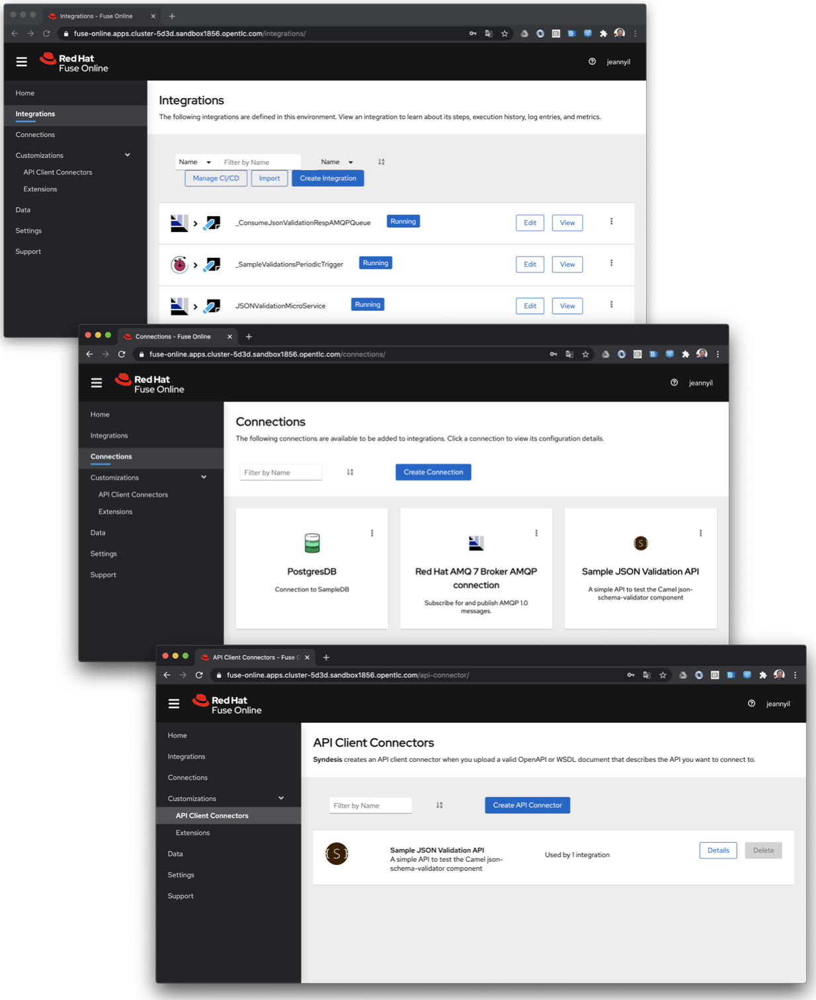

# RESTFul API consumption and AMQP messaging

The following _Red Hat Fuse Online_ integrations illustrate how to publish and subscribe to AMQP messages as well as how to consume RESTful APIs.

- `JSONValidationMicroService` : _Red Hat Fuse Online_ integration that listens for JSON payloads from the `JSON.VALIDATION.REQ` AMQP queue and then calls the [Sample JSON Validation RESTful API](https://github.com/jeanNyil/fuse-7-springboot-demos/tree/master/sample-json-validation-api) for validation purposes. Successful validation responses are sent to the `JSON.VALIDATION.OK.RESP` AMQP queue.

    - _Red Hat Fuse Online_ integration export: [JSONValidationMicroService-export.zip](./JSONValidationMicroService-export.zip)

- `_SampleValidationsPeriodicTrigger` : _Red Hat Fuse Online_ integration that sends, periodically (every 5mn), constant JSON payload messages to the `JSON.VALIDATION.REQ` AMQP queue so the `JSONValidationMicroService` integration can validate them.

    - _Red Hat Fuse Online_ integration export : [_SampleValidationsPeriodicTrigger-export.zip](./_SampleValidationsPeriodicTrigger-export.zip)

- `_ConsumeJsonValidationRespAMQPQueue` : _Red Hat Fuse Online_ integration that consumes AMQP messages from the `JSON.VALIDATION.OK.RESP` queue and logs them.

    - _Red Hat Fuse Online_ integration export : [_ConsumeJsonValidationRespAMQPQueue-export.zip](./_ConsumeJsonValidationRespAMQPQueue-export.zip) 

The following screenshot shows the main _Red Hat Fuse Online_ components involved in this use-case.

- _Red Hat Fuse Online_ integrations

- _Red Hat Fuse Online_ connections:

    - _Red Hat AMQ 7 Broker_ AMQP Connection
    - _Sample JSON Validation API_ RESTful connection

- _Sample JSON Validation API_ client connector

## Import instructions

:construction: **TODO**
