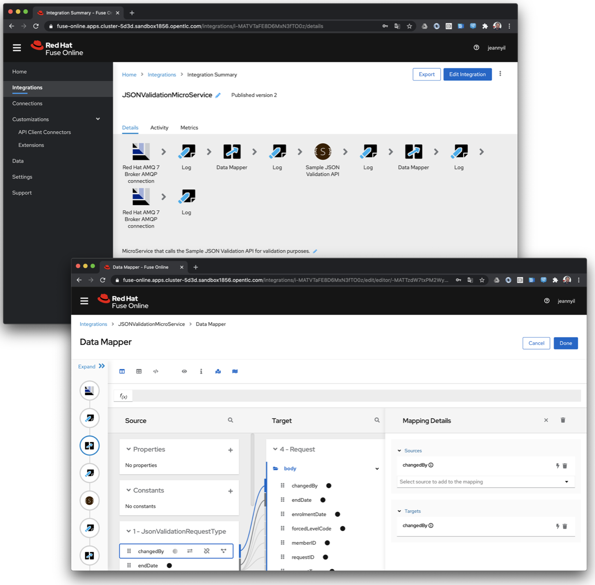
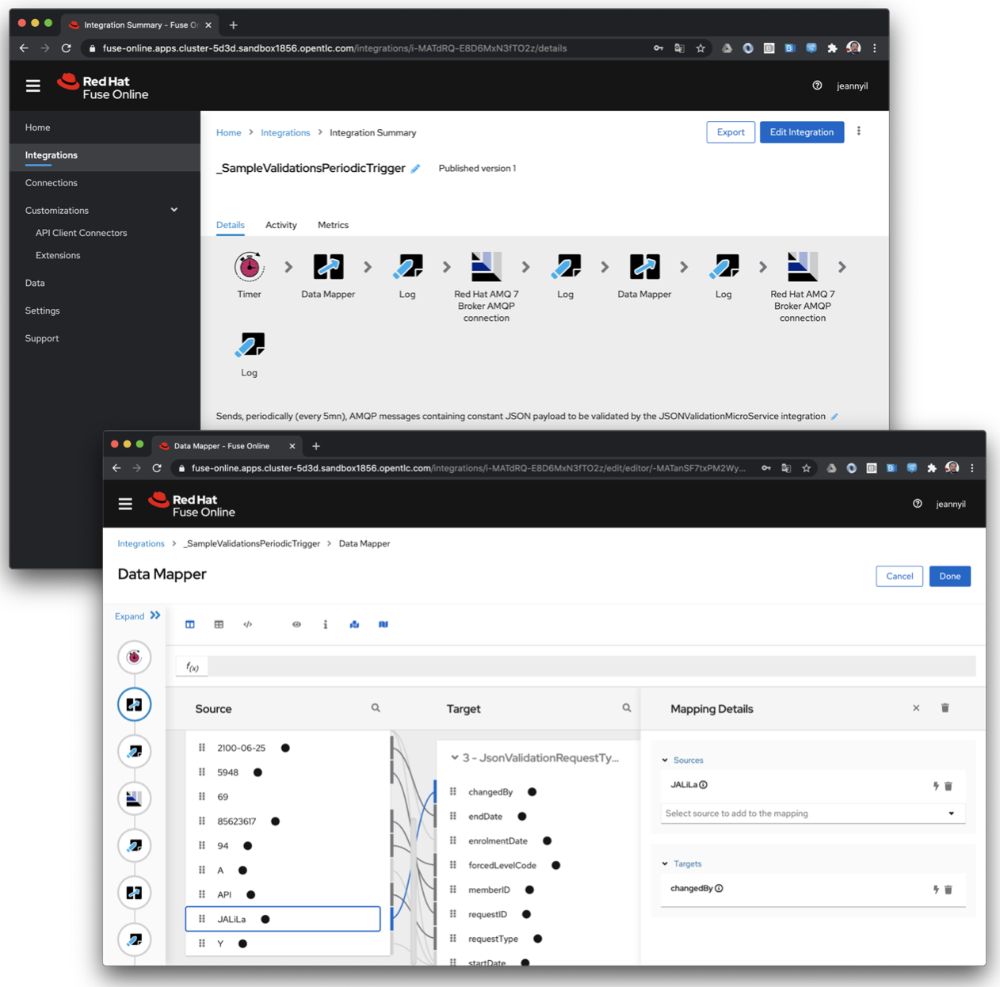
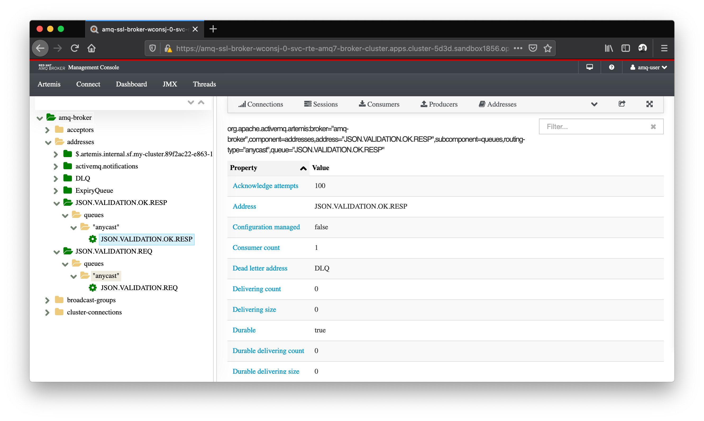

# RESTFul API consumption and AMQP messaging

The following _Red Hat Fuse Online_ integrations illustrate how to publish and subscribe to AMQP messages as well as how to consume RESTful APIs.

- `JSONValidationMicroService` : _Red Hat Fuse Online_ integration that listens for JSON payloads from the `JSON.VALIDATION.REQ` AMQP queue and then calls the [Sample JSON Validation RESTful API](https://github.com/jeanNyil/fuse-7-springboot-demos/tree/master/sample-json-validation-api) for validation purposes. Successful validation responses are sent to the `JSON.VALIDATION.OK.RESP` AMQP queue. Export archive : [JSONValidationMicroService-export.zip](./integrations/JSONValidationMicroService-export.zip)

    

- `_SampleValidationsPeriodicTrigger` : _Red Hat Fuse Online_ integration that sends, periodically (every 5mn), constant JSON payload messages to the `JSON.VALIDATION.REQ` AMQP queue so the `JSONValidationMicroService` integration can validate them. Export archive :  [_SampleValidationsPeriodicTrigger-export.zip](./integrations/_SampleValidationsPeriodicTrigger-export.zip)

    

- `_ConsumeJsonValidationRespAMQPQueue` : _Red Hat Fuse Online_ integration that consumes AMQP messages from the `JSON.VALIDATION.OK.RESP` queue and logs them. Export archive :  [_ConsumeJsonValidationRespAMQPQueue-export.zip](./integrations/_ConsumeJsonValidationRespAMQPQueue-export.zip)

    

The following screenshot shows the main _Red Hat Fuse Online_ components involved in this use-case:
- _Red Hat Fuse Online_ integrations
- _Red Hat Fuse Online_ connections:
    - _Red Hat AMQ 7 Broker AMQP_ connection
    - _Sample JSON Validation API_ RESTful connection
- _Sample JSON Validation API_ client connector

## Import and deployment instructions

1. Import the integration `*.zip` archives in _Fuse 7.7 Online_:

    
    - [`_ConsumeJsonValidationRespAMQPQueue-export.zip`](./integrations/_ConsumeJsonValidationRespAMQPQueue-export.zip)
    - [`_SampleValidationsPeriodicTrigger-export.zip`](./integrations/_SampleValidationsPeriodicTrigger-export.zip)
    - [`JSONValidationMicroService-export.zip`](./integrations/JSONValidationMicroService-export.zip)

2. Update the _Red Hat AMQ 7 Broker AMQP connection_ configuration according to your environment

    

3. Update the _Sample JSON Validation API_ `connection` configuration according to your environment

    

    as well as the _Sample JSON Validation API_ `api client connector`

    

4. Edit and save each integration before publishing them so the new connectors settings can be taken into account.

5. Once the _Fuse 7.7 Online_ integrations are deployed and running, you should be able to see the AMQP queues that have been automatically created.

    
